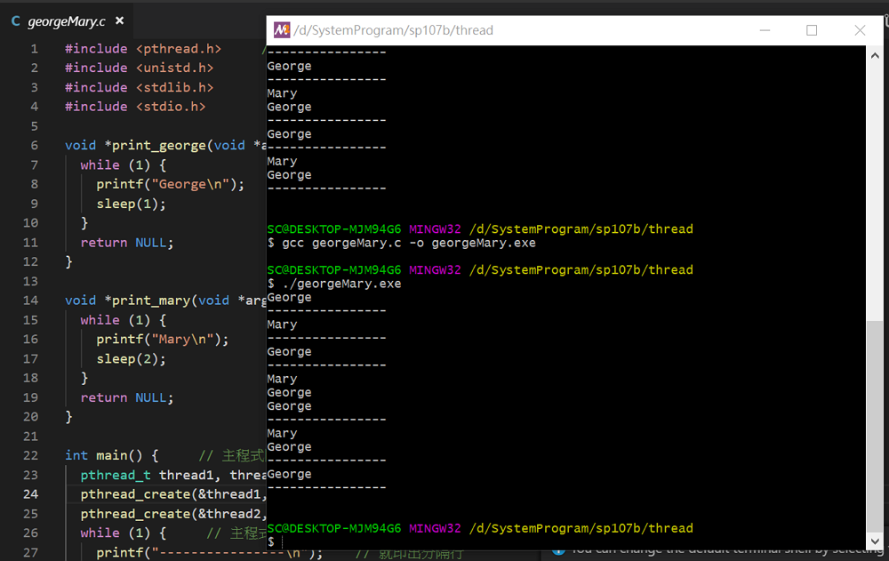
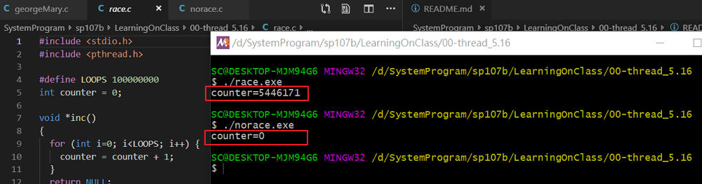

# 一、課堂實作

## 1. georgeMary 模仿 Thread

```
$ gcc georgeMary.c -o georgeMary.exe
$ ./georgeMary
```
看似 3個程序在跑 George Mary main()

### 實作結果



## 2. race.s

```
$ gcc race.c -o race.exe
$ ./race
```

### 程式段：傳統迴圈

```
void *inc()
{
  for (int i=0; i<LOOPS; i++) {
    counter = counter + 1;
  }
  return NULL;
}

void *dec()
{
  for (int i=0; i<LOOPS; i++) {
    counter = counter - 1;
  }
  return NULL;
}
```

## 3. norace

```
$ gcc norace.c -o norace.exe
$ ./norace
```

### 程式段：執行緒

```
void *inc()
{
  for (int i=0; i<LOOPS; i++) {
    pthread_mutex_lock( &mutex1 );
    counter = counter + 1;
    pthread_mutex_unlock( &mutex1 );
  }
  return NULL;
}

void *dec()
{
  for (int i=0; i<LOOPS; i++) {
    pthread_mutex_lock( &mutex1 );
    counter = counter - 1;
    pthread_mutex_unlock( &mutex1 );
  }
  return NULL;
}
```

### 實作結果



