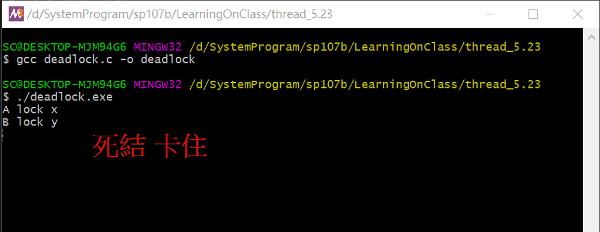

# 一、課堂實作

## 1. deadlock

```
$ gcc deadlock.c -o deadlock
$ ./deadlock
```

### 程式段：兩個執行緒

```
void *A() 
{
    pthread_mutex_lock(&x);
    printf("A lock x\n");
    sleep(1);
    pthread_mutex_lock(&y);
    printf("A lock y\n");
    pthread_mutex_unlock(&y); 
    pthread_mutex_unlock(&x); 

    printf("finished A\n");

    pthread_exit(0);
}

void *B()
{
    
    pthread_mutex_lock(&y);
    printf("B lock y\n");
    sleep(1);
    pthread_mutex_lock(&x);
    printf("B lock x\n");
    pthread_mutex_unlock(&x);
    pthread_mutex_unlock(&y);

    pthread_exit(0);
}
```

### 實作結果



# 二、參考資料

* [JS/Linux (x86)](https://bellard.org/jslinux/vm.html?url=https://bellard.org/jslinux/buildroot-x86.cfg)

* HelloWebServer修改來源 --- http://rosettacode.org/wiki/Hello_world/Web_server#C
