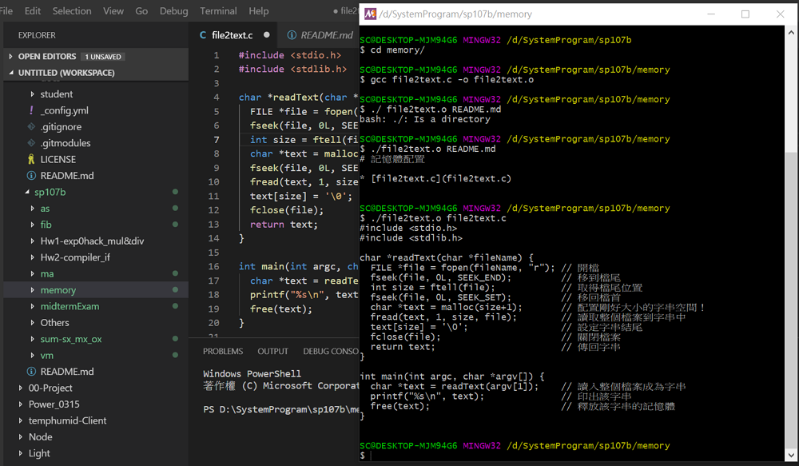
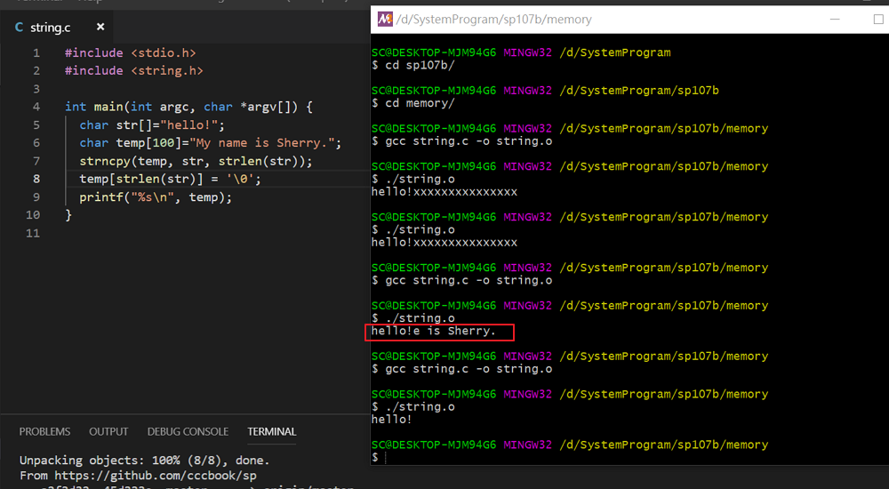
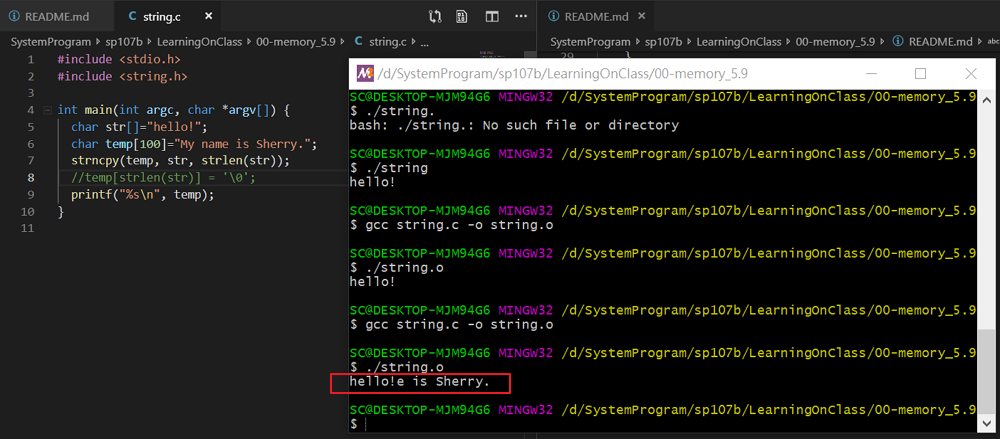

# 一、課堂實作

## 1. file2text 檔案內容輸出

```
$ gcc file2text.c -o file2text.o
$ ./file2text README.md
$ ./file2text file2text.c
```

### 實作結果



## 2. string 字串的存取

```
$ gcc string.c -o string.o
$ ./string.o
```

### 程式段：字串的結束

```
  temp[strlen(str)] = '\0';
```

### 實作結果

結尾有加 '\n'



結尾沒有加 '\n'



# 二、參考資料

* 記憶體配置 --- [file2text.c](file2text.c)

