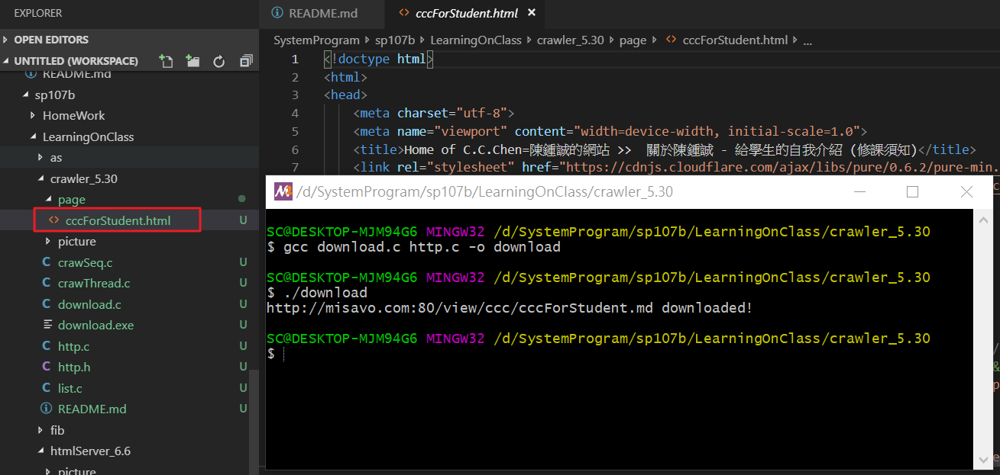
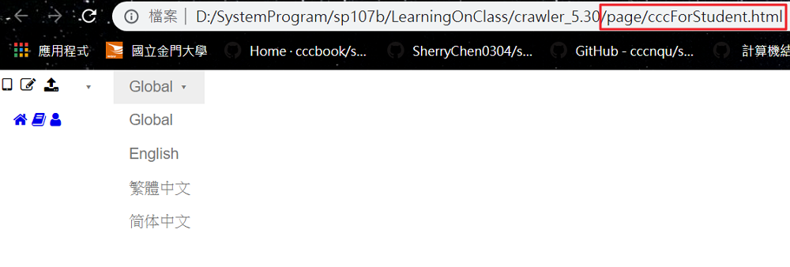
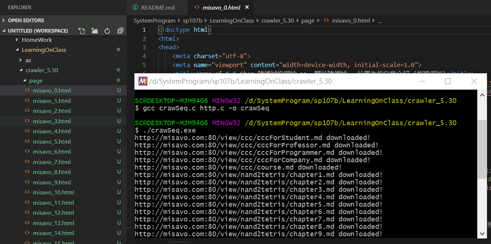
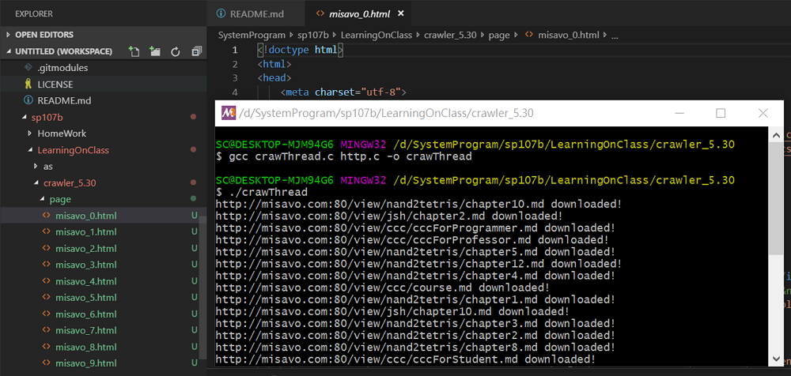

# 一、課堂實作

## 1. download 一個指定網頁

```
$ gcc download.c http.c -o download
$ ./download
```
抓出來的網頁用瀏覽器看會只有純粹html的介面，缺少css、javascript的檔案。（畫面會很醜）

### 實作結果





## 2. crawSequence

```
$ gcc crawSeq.c http.c -o crawSeq
$ ./crawSeq
```
利用傳統迴圈，連續download，「依序」抓28個網頁。 速度慢

### 程式段：傳統迴圈

```
int main(int argc, char *argv[]) {
    char head[PACKET_MAX];
    for (int i=0; i<LIST_SIZE; i++) {
        char file[100];
        sprintf(file, "page/misavo_%d.html", i);
        httpDownload("misavo.com", "80", list[i], head, file);
    }
}

```

### 實作結果



## 3. crawThread

```
$ gcc crawThread.c http.c -o crawThread
$ ./crawThread
```
有多少個網頁需要download，就開多少個Thread一起跑，「一次」抓28個網頁。 速度快 （類似爬蟲） 

### 程式段：執行緒

```
int main() {
  pthread_t thread[LIST_SIZE];
  int idx[LIST_SIZE];
  for (int i=0; i<LIST_SIZE; i++) {
    idx[i] = i; // 不能直接傳 &i 進去，否則會因為共用而導致 bug，所以宣告 idx 陣列，避開共用問題！
    pthread_create(&thread[i], NULL, getPage, (void*) &idx[i]);
  }
  for (int i=0; i<LIST_SIZE; i++) {
    pthread_join(thread[i], NULL);
  }
  return 0;    
}
```

### 實作結果



# 二、參考資料

* [鄭中勝: 以 C Socket 實作 HTTP Client](https://notfalse.net/47/c-socket-http-client)

    * https://github.com/JS-Zheng/blog/blob/master/47.%20C%20Socket%20HTTP%20Client/main.c
