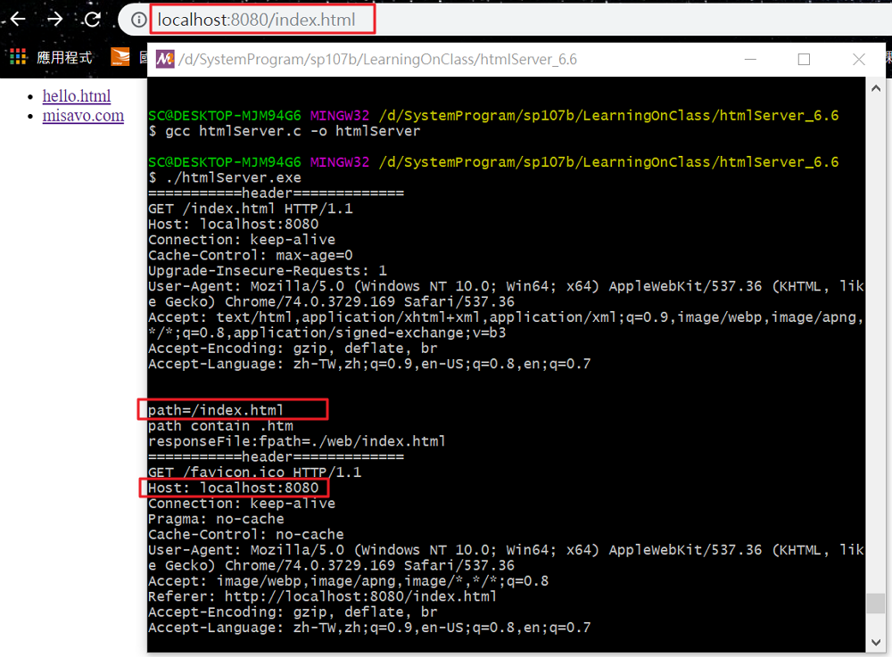
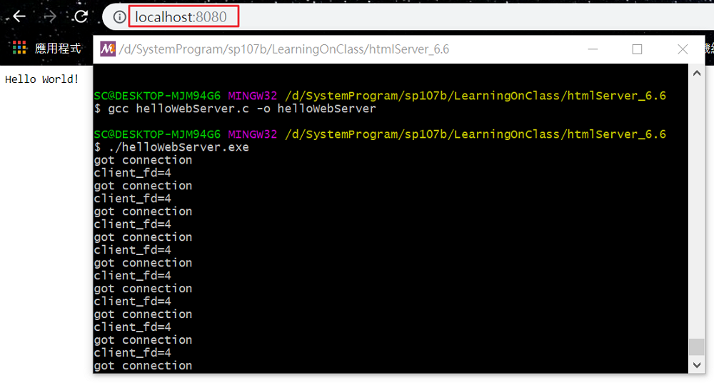
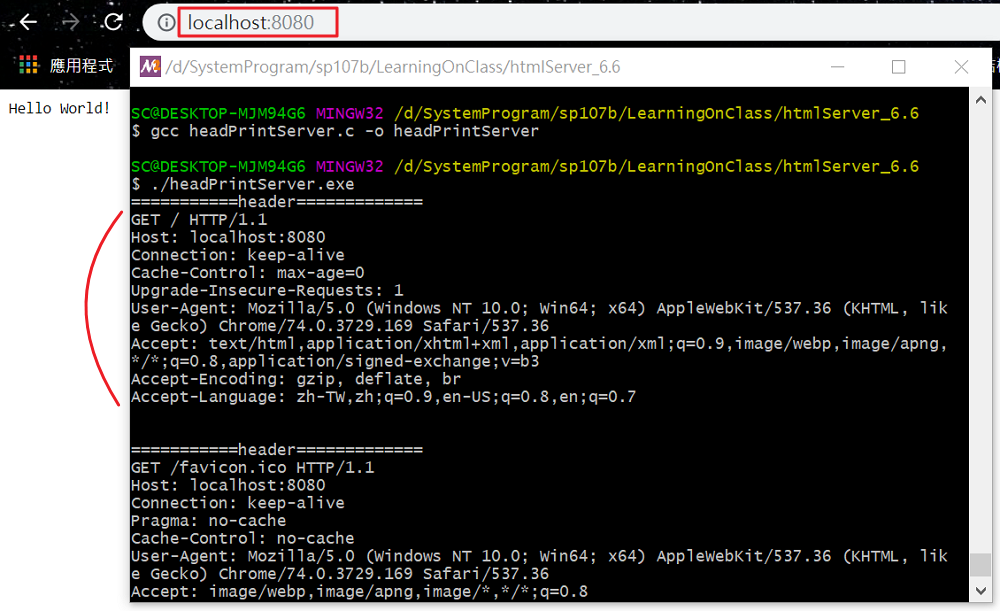

# 一、課堂實作

## 1. htmlServer

```
$ gcc htmlServer.c -o htmlServer
$ ./htmlServer
```

然後訪問 http://localhost:8080/index.html 可以看到網頁，任意點選連結訪問其他頁面。

### 程式段：http標頭

```
sprintf(response, "HTTP/1.1 200 OK\r\n"
                    "Content-Type: text/html; charset=UTF-8\r\n"
                    "Content-Length: %d\r\n\r\n%s", len, text);   // http的標頭，兩組\r\n，第四行是空行。
write(client_fd, response, strlen(response));
```

### 程式段：只讀取web裡的html檔

```
if (strstr(path, ".htm") != NULL) {
      printf("path contain .htm\n");   // 只有副檔名為.html的地方才會被執行出來
      responseFile(client_fd, path);
    } else {
      printf("not html => no response!\n");
    }
```

### 實作結果



## 2. helloWebServer.c

```
$ gcc helloWebServer.c -o helloWebServer
$ ./helloWebServer
```

網頁上顯示 hello world

### 實作結果



## 3. headPrintServer.c

```
$ gcc headPrintServer.c -o headPrintServer
$ ./headPrintServer
```

網頁上顯示 hello world，也會印出 http header 方便觀察。




# 二、參考資料

* [JS/Linux (x86)](https://bellard.org/jslinux/vm.html?url=https://bellard.org/jslinux/buildroot-x86.cfg)

* [HelloWebServer]修改來源 --- http://rosettacode.org/wiki/Hello_world/Web_server#C
